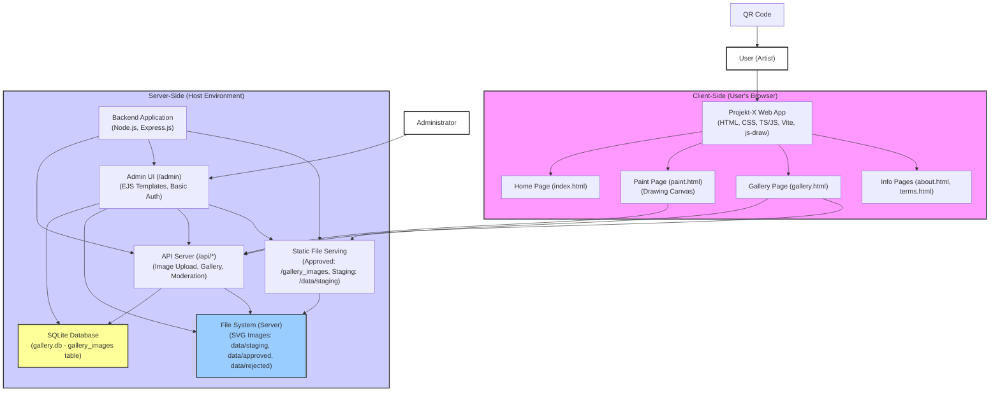

```mermaid
graph TD
    User["User (Artist)"]
    Admin["Administrator"]
    QR["QR Code"]

    subgraph ClientSide["Client-Side (User's Browser)"]
        direction TB
        WebApp["Projekt-X Web App<br/>(HTML, CSS, TS/JS, Vite, js-draw)"]
        WebApp_Home["Home Page (index.html)"]
        WebApp_Paint["Paint Page (paint.html)<br/>(Drawing Canvas)"]
        WebApp_Gallery["Gallery Page (gallery.html)"]
        WebApp_Info["Info Pages (about.html, terms.html)"]

        WebApp --> WebApp_Home
        WebApp --> WebApp_Paint
        WebApp --> WebApp_Gallery
        WebApp --> WebApp_Info
    end

    subgraph ServerSide["Server-Side (Host Environment)"]
        direction TB
        BackendApp["Backend Application<br/>(Node.js, Express.js)"]
        APIServer["API Server (/api/*)<br/>(Image Upload, Gallery, Moderation)"]
        AdminUI["Admin UI (/admin)<br/>(EJS Templates, Basic Auth)"]
        StaticServing["Static File Serving<br/>(Approved: /gallery_images, Staging: /data/staging)"]

        Database["SQLite Database<br/>(gallery.db - gallery_images table)"]
        ImageStorage["File System (Server)<br/>(SVG Images: data/staging, data/approved, data/rejected)"]

        BackendApp --> APIServer
        BackendApp --> AdminUI
        BackendApp --> StaticServing
        APIServer --> Database
        APIServer --> ImageStorage
        AdminUI --> Database
        AdminUI --> ImageStorage
        StaticServing --> ImageStorage
    end

    %% User and Admin Interactions
    QR --> User
    User --> WebApp
    WebApp_Paint --> APIServer
    WebApp_Gallery --> APIServer
    WebApp_Gallery --> StaticServing

    Admin --> AdminUI
    AdminUI --> APIServer
    AdminUI --> StaticServing

    %% Styling
    classDef client fill:#f9f,stroke:#333,stroke-width:2px
    classDef server fill:#ccf,stroke:#333,stroke-width:2px
    classDef db fill:#ff9,stroke:#333,stroke-width:2px
    classDef fs fill:#9cf,stroke:#333,stroke-width:2px
    classDef actor fill:#fff,stroke:#000,stroke-width:2px

    class User,Admin actor
    class ClientSide client
    class ServerSide server
    class Database db
    class ImageStorage fs
```
