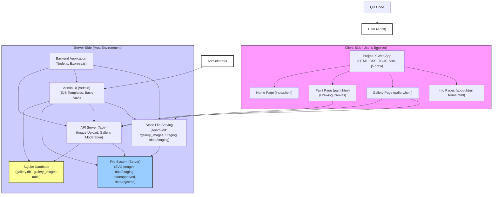

### Digital canvas for the Sarajevo Street Art Festival

#### Introduction
'Sup Sarajevo,

The city is now a **DIGITAL CANVAS**. No hassle with the authorities or resident permission, **PAINT THE CITY WALLS, FLOORS, TRAMS...** from your screens - no cops, no cleanup, **SOME RULES APPLY** so we have no drama.

Your city breathes art - the walls, the streets, the food, the people - they all have a vibe that inspires, fuels, and colours life in Sarajevo. It's something **I**'ve felt from day 1.

For one week, leading up to the **SARAJEVO STREET ART FESTIVAL**, photograph and unleash your creativity here. Save your creations - share them with #sarajevostreetart, and add them to the public **GALLERY**. During festival week the gallery is going all across the city on **digital screens and billboards**, lighting up Sarajevo.

This is my respect to this city, to all you who make it what it is - express yourself and leave no surface behind.

What are you waiting for?

#### Main Features
1. A drawing canvas
2. Upload art to socials
3. Upload art to gallery
4. Download art to local drive
5. City-wide art display
6. Donate to local art/culture initiative - *Optional*

#### Pages
1. Introduction/home: `/`
2. Drawing page: `/paint.html`
3. Gallery: `/gallery.html`
4. Terms and conditions: `/terms.html`
5. About/Contact: `/about.html`
6. Donate - `TBD`

#### TODO
**Core feature implementations**
 - [X] Home/Intro page ====================== May 22nd
 - [X] About/Contact page =================== May 27th
 - [X] Terms and Conditions page ============ May 27th
 - [X] Gallery page ========================= May 27th - 28th May
    - [X] Gallery architecture design
    - [X] Database installation
    - [X] Gallery API design
    - [X] Gallery API (POST/GET) implementation
    - [ ] Gallery page styling ============== May 29th
 - [X] Drawing page ========================= May 25th
   - [X] Create "Upload image button" ======= May 28th
   - [ ] Create "Download image button" ===== May 29th
   - [ ] Style buttons ====================== May 29th
 - [X] Custom pen - Wavy/Calligraphic ======= May 26th
 - [X] Upload art to gallery ================ May 29th
 - [X] Backend Routing ====================== May 28th
 - [ ] Frontend Routing ===================== May 29th
 - [X] Generate QR code for home page ======= May 29th

 **Optional features**
 - [ ] Upload art to socials ================ TBD
 - [ ] Donate page ========================== TBD

**Demo**
   - [X] Prepare presentation =============== May 30th
   - [X] Demo
   - [X] Prepare testing feedback doc ======= May 30th

**Action items from feedback**
 - [ ] Design a Tutorial overlay to:
    - [ ] Emphasise uploading an image to the drawing canvas
    - [ ] Show that the canvas can be resized
    - [ ] Give brief description of the tools in toolbar
    - [ ] Emphasise user exploration of the drawing tools
 - [ ] Create option to pick from a gallery of preset backgrounds. =================== June 5th

**Backup**
 - [X] Upload project to github ============= May 29th

**Documentation**
 - [X] Application architecture (Ongoing)
 - [X] User story (Ongoing)
 - [ ] Roadmap to festival

#### Application architecture

#### User story

#### Roadmap to festival

#### Commands
 - Start backend: `node server/server.js`
 - Start frontend: `npm run dev:frontend -- --host`

 Design a Tutorial overlay to:
  - Emphasise uploading an image to the drawing canvas
  - Show that the canvas can be resized
  - Give brief description of the tools in toolbar
  - Emphasise user exploration of the drawing tools
