# Tutorial: js-draw

js-draw is a JavaScript library for embedding a drawing editor in web pages.
The **Editor** is the main application instance, managing the *digital canvas* (**EditorImage**)
that stores all drawing elements (**AbstractComponent**s).
It handles user interaction through various **BaseTool**s, coordinated by the **ToolController**,
controls the user's *view* of the drawing (**Viewport**), and tracks all changes using *undoable actions* (**Command**s).
The user interacts with the editor primarily through controls provided by the **AbstractToolbar**.


## Visual Overview

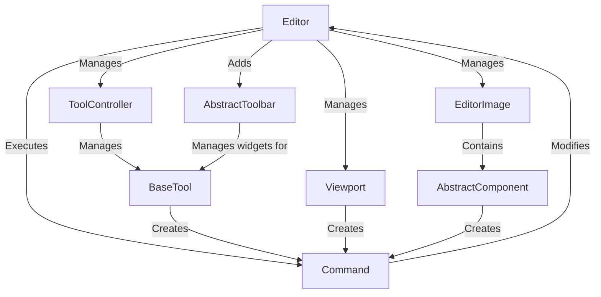

## Chapters

1. [Editor
](01_editor_.md)
2. [EditorImage
](02_editorimage_.md)
3. [AbstractComponent
](03_abstractcomponent_.md)
4. [BaseTool
](04_basetool_.md)
5. [Viewport
](05_viewport_.md)
6. [AbstractToolbar
](06_abstracttoolbar_.md)
7. [ToolController
](07_toolcontroller_.md)
8. [Command
](08_command_.md)

---

# Chapter 1: Editor

Welcome to the `js-draw` tutorial! This library helps you embed a drawing tool directly into your webpage. The very first thing you need to understand is the central piece of this library: the **Editor**.

### What is the Editor?

Imagine you're building a simple drawing application in your web browser. You'd need a place for the user to draw, tools like a pen or eraser, a way to zoom and pan around, and perhaps a toolbar to select tools and change colors.

In `js-draw`, all these parts come together under one main object: the `Editor`. Think of the `Editor` instance as the entire drawing application running on your page. It's the main entry point you interact with to create, configure, and manage your drawing interface.

Creating an `Editor` instance is the essential first step to using `js-draw`.

### Creating Your First Editor

To get a drawing editor up and running on your page, you need to:
1.  Import the `Editor` class from the `js-draw` library.
2.  Import the necessary styles for the editor's appearance.
3.  Create a new `Editor` instance, telling it which HTML element on your page it should live inside.

Let's see the most basic code for this:

```ts
import Editor from 'js-draw';
import 'js-draw/styles'; // Import the default CSS styles

// Find an HTML element on your page where you want the editor to go.
// We'll use the <body> element for simplicity here.
const containerElement = document.body;

// Create a new Editor instance inside the container element
const editor = new Editor(containerElement);
```

This simple code creates the `Editor` object and places its necessary HTML structure within the `<body>` of your page. The `import 'js-draw/styles';` line makes sure the editor looks correct by applying the default CSS rules.

If you ran this code, you'd see a drawing area appear, but it wouldn't have any visible tools yet.

### Adding a Toolbar

A drawing editor is not very useful without tools! The most common way to give users tools is by adding a toolbar. The `Editor` object provides a simple method to add a default toolbar with common tools like a pen, eraser, and selection tool.

You can add a default toolbar like this:

```ts
// Assuming you have already created the editor instance:
// const editor = new Editor(document.body);

// Add the default toolbar to the editor
editor.addToolbar();
```

This single line tells the `Editor` to create its standard toolbar and add it to the user interface.

### Putting It Together: A Minimal Example

Combining the steps above gives you a basic, functional drawing editor embedded in your webpage:

```ts
import Editor from 'js-draw';
import 'js-draw/styles'; // Required for default styling

// Get the element where the editor will be placed
const containerElement = document.body;

// Create the Editor instance
const editor = new Editor(containerElement);

// Add the default toolbar
editor.addToolbar();

// You might want to give the editor a specific size:
// editor.getRootElement().style.height = '500px';
```

When you run this code, `js-draw` will:
1.  Create a main container `div` element for the editor.
2.  Place this container inside `document.body`.
3.  Inside this container, set up the area where drawing happens.
4.  Add a default toolbar with buttons for common drawing tools.
5.  Apply the default styling, making the editor visible and usable.

You should now see a drawing area with a toolbar, ready for drawing!

### Under the Hood (Simplified)

When you call `new Editor(...)`, the `Editor` object acts like a conductor, setting up and connecting several different parts required for the drawing application.

Here's a simplified look at what happens:

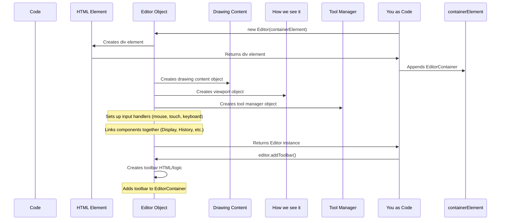

The `Editor` is responsible for creating and holding references to these key components:

*   **[`EditorImage`](02_editorimage_.md):** This is where your drawing *data* lives. It holds all the shapes, lines, and images you add.
*   **[`Viewport`](05_viewport_.md):** This manages how you view the `EditorImage` – controlling zooming, panning, and rotation.
*   **[`ToolController`](07_toolController_.md):** This manages the different tools available (like the pen, eraser, etc.) and decides which tool is currently active.
*   **[`AbstractToolbar`](06_abstracttoolbar_.md):** While `addToolbar()` creates a specific toolbar implementation, the `Editor` coordinates with the concept of a toolbar to provide user interface controls.

The `Editor` also handles important tasks like:
*   Dispatching user input (like mouse clicks, touch gestures, keyboard presses) to the correct parts, usually the active tool.
*   Managing the undo/redo history ([`Command`](08_command_.md)s).
*   Rendering the `EditorImage` to the screen using the current `Viewport` settings.
*   Loading and saving the drawing.

### Customizing the Editor

The basic `new Editor(containerElement)` creates an editor with default settings. However, the `Editor` constructor can also accept a second argument: a settings object. This allows you to customize various aspects of the editor, like enabling/disabling mouse wheel events for zooming, changing the allowed zoom range, or providing custom localizations (language translations).

```ts
import Editor from 'js-draw';
import 'js-draw/styles';

const containerElement = document.body;

// Create an Editor with some custom settings
const editor = new Editor(containerElement, {
  wheelEventsEnabled: 'only-if-focused', // Only zoom with wheel if editor has focus
  minZoom: 0.1, // Allow zooming out to 10%
  maxZoom: 10,  // Allow zooming in to 1000%
  // ... other settings
});

editor.addToolbar();
```

We won't go into detail about all the settings here, but just know that the `Editor` constructor is where you provide initial configuration.

### Conclusion

In this chapter, you learned that the `Editor` is the main object that represents an instance of the `js-draw` drawing application on your webpage. It's created by passing an HTML element to its constructor and manages all the other components like the drawing content, the view, and the tools. You saw how to create a basic `Editor` and add a default toolbar to get a functional drawing area.

In the next chapter, we'll dive into what the `Editor` is editing – the drawing itself, which is managed by the **EditorImage**.

# Chapter 2: EditorImage

Welcome back to the `js-draw` tutorial! In the [previous chapter](01_editor_.md), we learned that the `Editor` is the main object that sets up and manages your drawing application. It's the conductor of the orchestra, but what is the orchestra *playing*? What is the actual *drawing content* that the `Editor` is displaying and modifying?

This is where the **EditorImage** comes in.

### What is the EditorImage?

Imagine the `Editor` is the entire drawing application window with its tools and controls. The `EditorImage` is the actual digital paper or canvas where your drawing exists. It's not the visual representation you see on your screen (that's handled by other parts, like the [Viewport](05_viewport_.md) and rendering), but the underlying *data* structure.

Think of the `EditorImage` as a container that holds *everything* you draw:
*   Lines and strokes
*   Text boxes
*   Inserted images
*   Any other visual elements you add

The `EditorImage` keeps track of all these items, their positions, sizes, colors, and other properties. It's the source of truth for your drawing. When you save your drawing, you're saving the data from the `EditorImage`. When you load a drawing, you're loading data *into* the `EditorImage`.

### Accessing the EditorImage

The `Editor` object you created in Chapter 1 gives you access to its `EditorImage` instance through the `.image` property. There's only one `EditorImage` per `Editor` instance.

```ts
import Editor from 'js-draw';
import 'js-draw/styles';

const containerElement = document.body;
const editor = new Editor(containerElement);
editor.addToolbar();

// Get the EditorImage instance from the editor
const myDrawingContent = editor.image;

console.log('The Editor has an image:', myDrawingContent instanceof EditorImage);
```

This `myDrawingContent` variable now holds the object that represents your drawing's data.

### Adding Something to the Drawing

A common task is adding new elements to the drawing, like a shape or a line. The `EditorImage` has methods for this. The primary method for adding elements is `addComponent`.

However, in `js-draw`, actions that change the drawing content are often wrapped in **Commands**. This is how the undo/redo history works (we'll cover [Commands](08_command_.command.md) in a later chapter). So, `editor.image.addComponent()` doesn't *directly* add the item, but instead *returns a Command* that, when executed, will add the item. You then execute this command using `editor.dispatch()`.

This might sound a little complex now, but the pattern is straightforward:

1.  Create the drawing element (a "Component").
2.  Ask the `EditorImage` for a [Command](08_command_.md) to add this element.
3.  Give that [Command](08_command_.md) to the `Editor`'s `dispatch()` method to execute it.

Let's add a simple rectangular shape. Creating a complex shape like a stroke requires understanding other concepts ([AbstractComponent](03_abstractcomponent_.md), `Path`, `RenderingStyle`, etc.). For this simple example, we'll use a helper function like the one seen in the library's source code examples, which hides the complexity of creating a simple stroke for a rectangle.

```ts
import Editor, { Stroke, pathToRenderable, RenderingStyle } from 'js-draw';
import { Path, Color4, Vec2, Rect2 } from '@js-draw/math'; // Need math types
import 'js-draw/styles';

const containerElement = document.body;
const editor = new Editor(containerElement);
editor.addToolbar();

// --- Helper function to add a simple filled rectangle ---
function addBox(editorInstance: Editor, rect: Rect2, color: Color4) {
    // Create a Path for the rectangle
	const path = Path.fromRect(rect);

    // Define how it should look (rendering style)
	const style: RenderingStyle = { fill: color };

    // Create a Stroke component from the path and style
	const stroke = new Stroke([
		pathToRenderable(path, style)
	]);

    // Ask the EditorImage for a Command to add the stroke
    // editorInstance.image is the EditorImage!
	const addCommand = editorInstance.image.addComponent(stroke);

    // Dispatch the command to the editor to add the stroke
	editorInstance.dispatch(addCommand);
}
// --------------------------------------------------------


// Now, let's add a red box at image coordinates (100, 50) with size 40x30
const boxRect = new Rect2(100, 50, 40, 30);
const redColor = Color4.red;

addBox(editor, boxRect, redColor);

// If you run this code, you will see a small red rectangle appear on the drawing canvas.
```

**Explanation:**

1.  We import `Editor` and styles as before.
2.  We also import some types from `js-draw` and `@js-draw/math` needed to define a shape and its appearance. Don't worry about these details yet; we'll cover elements ([AbstractComponent](03_abstractcomponent_.md)) later.
3.  The `addBox` function simplifies creating and adding a rectangular stroke.
4.  Inside `addBox`, we create the `Stroke` component.
5.  Crucially, `editorInstance.image.addComponent(stroke)` is called. This tells the `EditorImage` "Prepare a command to add this `stroke` component".
6.  `editorInstance.dispatch(addCommand)` executes the command. The `Editor` receives the command, tells it to `apply()`, which internally tells the `EditorImage` to incorporate the component into its data structure. The `Editor` also adds this command to its undo history.

If you ran this code, you would see a small red rectangle appear on the drawing canvas, positioned at image coordinates (100, 50).

### Finding Components

The `EditorImage` doesn't just store components; it also provides ways to retrieve them. A very useful method is `getComponentsIntersecting(region: Rect2)`, which finds all components whose bounding boxes overlap with a given rectangular area.

Let's find the red box we just added:

```ts
// Assuming editor and the red box were added as in the previous example

// Define a region (rectangle) to search within
// This rectangle covers where we put the red box
const searchRegion = new Rect2(90, 40, 60, 50); // A bit larger than the red box

// Ask the EditorImage for components intersecting this region
const componentsInRegion = editor.image.getComponentsIntersecting(searchRegion);

console.log(`Found ${componentsInRegion.length} component(s) in the search region.`);

// You can examine the components found
if (componentsInRegion.length > 0) {
    const firstComponent = componentsInRegion[0];
    console.log('First component found is a:', firstComponent.description());
    // You might see something like: "Found 1 component(s) in the search region.\nFirst component found is a: stroke"
}
```

This shows how you can query the `EditorImage` to find drawing elements based on their location.

### Under the Hood (Simplified)

How does the `EditorImage` efficiently manage potentially many components and quickly find ones in a specific area? It doesn't just store them in a simple flat list. Internally, it uses a spatial data structure – specifically, a tree of **`ImageNode`** objects.

*   The `EditorImage` has a root `ImageNode`.
*   `ImageNode`s can either hold a single drawing **[Component](03_abstractcomponent_.md)** (these are like the "leaves" of the tree) or they can be container nodes holding other `ImageNode`s as children.
*   Container nodes have a bounding box that encompasses the bounding boxes of all their children.
*   This tree structure allows `getComponentsIntersecting` to quickly narrow down the search. If a container node's bounding box doesn't intersect the search region, none of its children can, so that whole branch of the tree can be skipped.

Here's a simplified sequence diagram for adding a component:

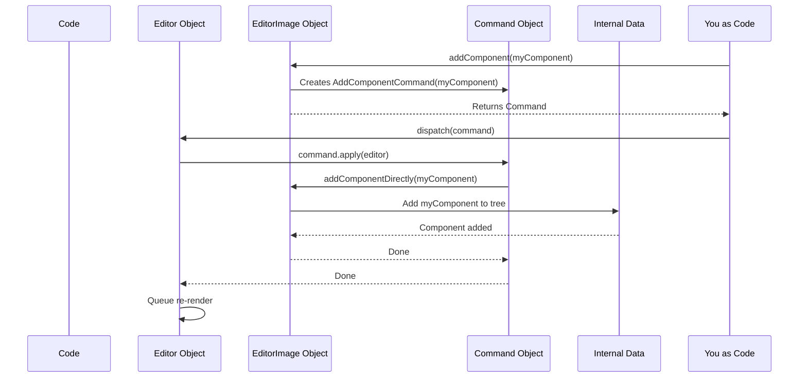

When you call `editor.image.addComponent()`, the `EditorImage` prepares the action as an `AddComponentCommand`. You then `dispatch` this command via the `Editor`. The `Editor` executes the command's `apply` method, which internally calls a private method on `EditorImage` (like `addComponentDirectly`) to actually modify the internal `ImageNode` tree and update the data structure.

This tree structure (`ImageNode`), defined within the `EditorImage.ts` file in the library's source code, is key to the `EditorImage`'s performance, especially with many drawing elements.

### Saving and Loading

Because the `EditorImage` holds *all* the drawing data, it's the object responsible for saving and loading. The `Editor` provides methods like `toSVG()` or `saveContent()` which interact with the `EditorImage` to get its data in a serializable format. Similarly, loading involves parsing data and using the `Editor` (which modifies the `EditorImage`) to recreate the components.

### Conclusion

The `EditorImage` is the core data container for your drawing in `js-draw`. It holds all the visual elements as [Components](03_abstractcomponent_.md), manages their addition, removal, and lookup, and is the data source for saving and loading. You access it via `editor.image`. Adding elements involves creating a [Component](03_abstractcomponent_.md), getting an add [Command](08_command_.md) from `editor.image.addComponent()`, and dispatching that command using `editor.dispatch()`. Internally, it uses a tree structure for efficient management.

Now that you understand where the drawing data lives (`EditorImage`), the next logical step is to look at *what* data is stored there – the individual drawing elements, known as **AbstractComponents**.

# Chapter 3: AbstractComponent

Welcome back! In the [previous chapter](02_editorimage_.md), we learned that the `EditorImage` is the central container for all the drawing data – the lines, text, and shapes that make up your drawing.

But what *are* those individual lines, text boxes, and shapes stored inside the `EditorImage`? How does the `EditorImage` manage such different kinds of visual elements?

This is where the concept of **AbstractComponent** comes in.

### What is an AbstractComponent?

Imagine the `EditorImage` as a folder holding many different documents. Some documents might be drawings, some might be typed letters, and some might be printed pictures. To keep them organised and know how to handle them (like displaying them or finding words), they might all follow a basic structure or standard format.

In `js-draw`, the `AbstractComponent` is that standard blueprint. It's a base class that defines the fundamental characteristics and behaviors that *every* visual item on the canvas must have.

Every single thing you draw or add to the `EditorImage` – whether it's a stroke from the pen tool, a block of text, or an image you paste – is an instance of a class that inherits from `AbstractComponent`.

Think of `AbstractComponent` as the "interface" or "contract" that all drawing elements agree to follow.

### Why do we need AbstractComponent?

The `EditorImage` needs to perform common actions on *all* the items it contains, regardless of what kind of item they are. For example, the `EditorImage` needs to:

*   **Display** all items on the screen.
*   Figure out which items are **visible** in the current view (controlled by the [Viewport](05_viewport_.md)).
*   Allow items to be **selected**, **moved**, **resized**, or **rotated** by tools ([BaseTool](04_basetool_.md)).
*   Check if an item has been **erased** by the eraser tool.
*   **Save** and **Load** the drawing, which means being able to represent each item in a file format.

Instead of the `EditorImage` having complex logic like "if it's a stroke, draw it this way; if it's text, draw it that way," it simply knows that every item is an `AbstractComponent`. It can then tell each component, "Hey, `AbstractComponent`, draw yourself!" or "Hey, `AbstractComponent`, tell me if this line intersects you!"

Each specific type of component (like `Stroke` or `TextComponent`) implements *how* to perform these actions according to its own nature.

### Key Responsibilities of an AbstractComponent

Every class that extends `AbstractComponent` must implement certain methods that define its core behavior:

*   **`render(...)`**: How the component draws itself onto a given canvas (an `AbstractRenderer`).
*   **`getBBox()`**: Returns a rectangle representing the bounding box (the smallest rectangle that completely contains the component). This is crucial for performance (only drawing what's visible) and interaction.
*   **`intersects(...)`**: Checks if a given line segment crosses or touches the component. Used by tools like the selection and eraser tools.
*   **`applyTransformation(...)`**: Updates the component's position, size, or rotation based on a mathematical transformation matrix.
*   **`description()`**: Provides a short text description of the component (e.g., "a stroke," "a text box"). Useful for accessibility.
*   **`createClone()`**: Creates an exact copy of the component.

By implementing these methods, any custom object can become a first-class citizen on the `js-draw` canvas.

### AbstractComponent in Action: Adding a Stroke

Let's look back at the code from [Chapter 2](02_editorimage_.md) where we added a red box. We can now understand the role of `AbstractComponent` in that example.

```ts
import Editor, { Stroke, pathToRenderable, RenderingStyle } from 'js-draw';
import { Path, Color4, Rect2 } from '@js-draw/math'; // Need math types
import 'js-draw/styles';

const containerElement = document.body;
const editor = new Editor(containerElement);
editor.addToolbar();

// --- Helper function to add a simple filled rectangle ---
function addBox(editorInstance: Editor, rect: Rect2, color: Color4) {
    // 1. Define the shape (a Path for the rectangle)
	const path = Path.fromRect(rect);

    // 2. Define how it should look (rendering style)
	const style: RenderingStyle = { fill: color };

    // 3. CREATE the drawing element (a Component)!
    //    A Stroke is a type of AbstractComponent.
	const stroke: Stroke = new Stroke([
		pathToRenderable(path, style)
	]);

    // 4. Ask the EditorImage for a Command to add this component (the stroke)
    //    editorInstance.image is the EditorImage!
	const addCommand = editorInstance.image.addComponent(stroke);

    // 5. Dispatch the command to the editor to execute it
	editorInstance.dispatch(addCommand);
}
// --------------------------------------------------------

// Add a red box at image coordinates (100, 50) with size 40x30
const boxRect = new Rect2(100, 50, 40, 30);
const redColor = Color4.red;

addBox(editor, boxRect, redColor);
```

In this code, the variable `stroke` holds an object of type `Stroke`. The `Stroke` class is one of the built-in components in `js-draw`, and critically, it *extends* `AbstractComponent`.

So, when we call `editorInstance.image.addComponent(stroke)`, we are passing an `AbstractComponent` instance to the `EditorImage`. The `EditorImage` doesn't need to know it's specifically a `Stroke` at this point; it just knows it has an object that knows how to `render()`, how to calculate its `getBBox()`, etc.

### Under the Hood (Simplified)

How does the `EditorImage` use the `AbstractComponent` blueprint?

As we saw in [Chapter 2](02_editorimage_.md), the `EditorImage` stores components internally, often in a tree structure for efficient lookup. When the `Editor` needs to draw the image (which happens frequently, especially during drawing or zooming), it tells the `EditorImage` to render.

The `EditorImage` then traverses its internal structure, and for each `AbstractComponent` it finds (and which is visible based on its `getBBox()` and the current [Viewport](05_viewport_.md)):

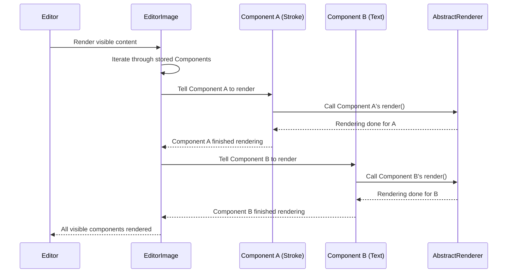

Notice how the `EditorImage` doesn't call `renderStroke()` or `renderText()`. It simply calls the generic `render()` method defined by `AbstractComponent` on each object. This is a core principle of object-oriented programming called **polymorphism** – treating objects of different types through a common interface.

Similarly, when the selection tool needs to see if you clicked on something, it gives a small line segment (representing the click path) to the `EditorImage`. The `EditorImage` finds potential components near that line segment and calls `intersects(lineSegment)` on each:

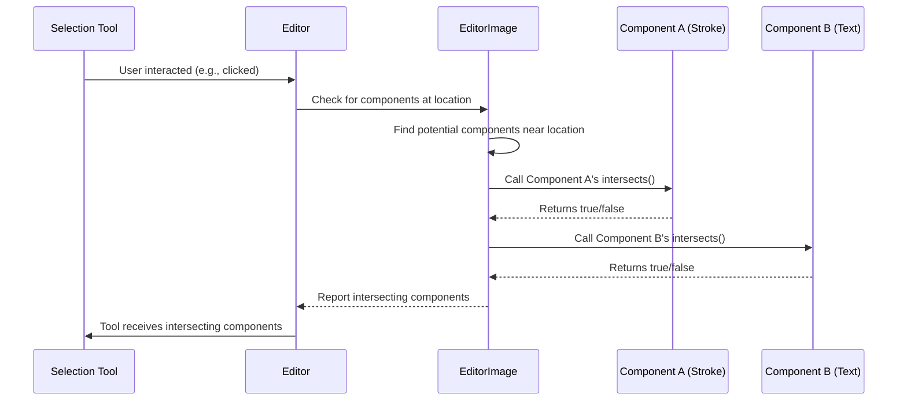

Again, the `EditorImage` doesn't need specific logic for `Stroke.intersects()` vs `TextComponent.intersects()`; it just calls the common `intersects()` method.

### Built-in Components

`js-draw` comes with several built-in classes that extend `AbstractComponent`:

*   `Stroke`: Represents a drawing stroke (a line or path).
*   `TextComponent`: Represents a block of editable text.
*   `ImageComponent`: Represents an inserted image.
*   `BackgroundComponent`: Used for background fills or patterns.

You primarily interact with instances of these classes when adding or manipulating content.

### Conclusion

The `AbstractComponent` is the fundamental building block for all visual elements within `js-draw`. It defines the essential behaviors (drawing, transforming, intersecting) that allow the `EditorImage` and various tools to interact with diverse types of drawing content in a consistent way. Every stroke, text box, or image you add is a specific kind of `AbstractComponent`.

Understanding this concept is key to working with the actual content of your drawings. Now that we know what the individual pieces of the drawing are (`AbstractComponent`) and where they live (`EditorImage`), let's look at how users create and interact with them: **Tools**.


# Chapter 4: BaseTool

Welcome back! In the last chapter, [AbstractComponent](03_abstractcomponent_.md), we learned that the visual elements that make up your drawing – the lines, shapes, and text – are all represented internally as **AbstractComponents**. We also saw that the [EditorImage](02_editorimage_.md) is where these components are stored and managed.

But how do these components get created in the first place? How does clicking and dragging your mouse or stylus turn into a line on the screen? This is the job of **Tools**.

### What is a BaseTool?

Think of the `Editor` as a workshop. The [EditorImage](02_editorimage_.md) is the canvas you're working on, and [AbstractComponent](03_abstractcomponent_.md)s are the materials (paint, clay, paper). But you need tools – brushes, erasers, sculpting tools – to actually *do* the work.

In `js-draw`, a `BaseTool` is the blueprint for one of these interactive tools. Each tool represents a specific *mode* of interaction within the editor.

*   The **Pen Tool** interprets your pointer movements to create new `Stroke` [AbstractComponent](03_abstractcomponent_.md)s.
*   The **Eraser Tool** interprets your pointer movements to find and remove existing [AbstractComponent](03_abstractcomponent_.md)s.
*   The **Selection Tool** lets you tap or drag to select, move, or resize [AbstractComponent](03_abstractComponent.md)s.
*   The **Pan/Zoom Tool** lets you change your view of the [EditorImage](02_editorimage_.md) ([Viewport](05_viewport_.md)).

Each `BaseTool` defines how the editor should respond to user inputs like mouse clicks, touch gestures, and keyboard presses when that tool is active.

You typically only have one "primary" tool active at a time (like the Pen *or* the Eraser), which receives the main pointer input. Other tools might handle background tasks like keyboard shortcuts (e.g., Undo/Redo).

### The Core Job: Handling Input

The primary role of any `BaseTool` is to listen for and respond to user input events. The [Editor](01_editor_.md) receives raw events from the browser (like `pointerdown`, `pointermove`, `pointerup`). It then figures out which tool should receive these events.

The `BaseTool` class provides methods that are called when specific input events occur while the tool is active. The most common ones for drawing or interacting with elements are:

*   `onPointerDown(event)`: Called when a mouse button is pressed or a touch/stylus starts. This is usually the signal to start a new action (like beginning a stroke or a selection).
*   `onPointerMove(event)`: Called repeatedly as the mouse/touch/stylus moves. This is where a drawing tool would add points to the current stroke or a selection tool would drag selected items.
*   `onPointerUp(event)`: Called when the mouse button is released or a touch/stylus ends. This typically finalizes the action (like completing and adding a stroke to the [EditorImage](02_editorimage_.md)).
*   `onGestureCancel(event)`: Called if the interaction is interrupted (e.g., by the browser showing a context menu or the user switching applications).

A tool decides if it wants to handle a `onPointerDown` event by returning `true`. If it returns `true`, it will continue to receive `onPointerMove` and `onPointerUp` events for that specific pointer sequence until `onPointerUp` returns `false` or the gesture is cancelled.

### How Input Flows to a Tool

When you interact with the editor (click, drag, etc.), the input doesn't go directly to a tool. It passes through a few layers:

1.  **User Input:** You click, drag, or press a key.
2.  **[Editor](01_editor_.md):** The `Editor` instance receives the raw browser event.
3.  **[ToolController](07_toolcontroller_.md):** The `Editor` sends the event to its `ToolController`. The `ToolController`'s job is to manage all the available tools and decide which one(s) should receive the input. It typically sends primary input events (like clicks/drags) to the currently active primary tool.
4.  **Active `BaseTool`:** The selected tool's corresponding method (`onPointerDown`, `onPointerMove`, etc.) is called.
5.  **Tool Logic:** The tool's code executes. For a pen tool, this involves creating or extending a `Stroke` [AbstractComponent](03_abstractcomponent_.md).
6.  **Modify [EditorImage](02_editorimage_.md):** If the tool changes the drawing (like adding a stroke), it typically creates a [Command](08_command_.md) and dispatches it via `editor.dispatch()`. This [Command](08_command_.md) then modifies the [EditorImage](02_editorimage_.md).

Here's a simplified look at the flow when you draw a line:

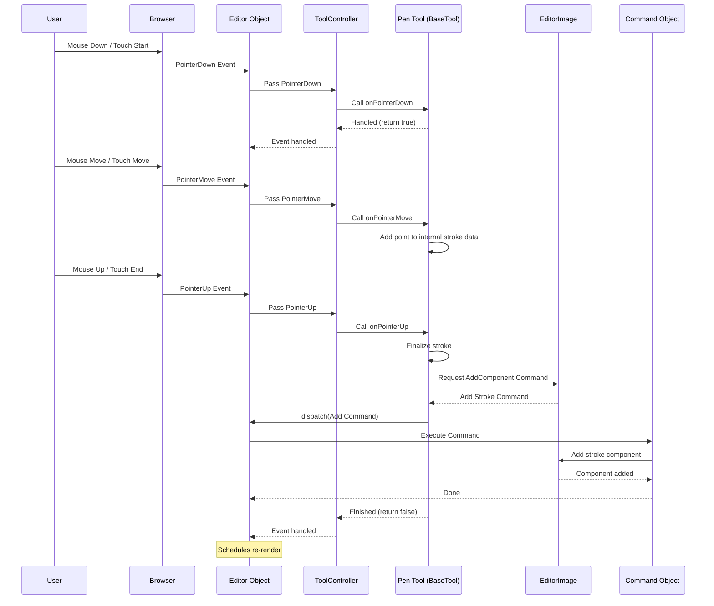

### Interacting with Tools

While you can create custom tools by extending `BaseTool`, you'll more often interact with the built-in tools provided by `js-draw`. You can access the tools managed by the editor through `editor.toolController`.

For example, to change the default color or thickness of the built-in `PenTool`, you'd get a reference to it from the `ToolController` and call methods like `setColor()` or `setThickness()` (these methods are specific to the `PenTool` class, which extends `BaseTool`).

```ts
import Editor, { PenTool, Color4 } from 'js-draw';
import 'js-draw/styles';

const containerElement = document.body;
const editor = new Editor(containerElement);
editor.addToolbar();

// Get the first PenTool from the tools managed by the editor's ToolController
const penTools = editor.toolController.getMatchingTools(PenTool);

if (penTools.length > 0) {
    const firstPen = penTools[0];

    // Change the default color of this PenTool to blue
    firstPen.setColor(Color4.blue);

    // Change the default thickness of this PenTool
    firstPen.setThickness(50); // Thickness is in image units
}

// Now, any new strokes drawn with this pen tool will be blue and thicker.
```

This code snippet shows that you don't necessarily need to understand all the input handling details of `BaseTool` to customize existing tools. You interact with tool-specific methods provided by concrete tool classes like `PenTool`.

### Enabling and Disabling Tools

Every `BaseTool` has an enabled/disabled state. Only enabled tools can potentially receive input events.

The `ToolController` manages which tool is currently "active" (usually the primary one that receives pointer events). You can explicitly enable or disable a tool:

```ts
// Assuming 'editor', 'penTools', and 'firstPen' from the previous example

// Disable the first pen tool
firstPen.setEnabled(false);

// Check if it's enabled
console.log('Is pen tool enabled?', firstPen.isEnabled()); // Output: Is pen tool enabled? false

// Enable it again
firstPen.setEnabled(true);
console.log('Is pen tool enabled?', firstPen.isEnabled()); // Output: Is pen tool enabled? true
```

Disabling a primary tool usually means another primary tool will become active (often the last one that was active, or a default one). The `ToolController` handles this switching logic.

### Built-in Tools

`js-draw` provides several tools built on `BaseTool`:

| Tool Class          | Description                                         | Primary Role                  |
| :------------------ | :-------------------------------------------------- | :---------------------------- |
| `PenTool`           | Draws freehand strokes or shapes.                   | Create `Stroke`s              |
| `EraserTool`        | Removes components.                                 | Modify `EditorImage`          |
| `SelectionTool`     | Selects, moves, resizes, rotates components.        | Modify `EditorImage`          |
| `TextTool`          | Creates and edits text boxes.                       | Create/Modify `TextComponent` |
| `PanZoomTool`       | Allows panning and zooming the view.                | Modify `Viewport`             |
| `UndoRedoShortcut`  | Handles keyboard shortcuts for undo/redo.           | Manage `Command` history      |
| `PasteHandler`      | Handles pasting content from the clipboard.         | Create/Modify `EditorImage`   |

These tools are typically created and managed by the `Editor`'s `ToolController` when you add a default toolbar or configure the editor.

### Conclusion

The `BaseTool` is the fundamental concept for interactive modes in `js-draw`. It defines the blueprint for objects that handle user input (mouse, touch, keyboard) and translate those interactions into actions, primarily by creating or modifying [AbstractComponent](03_abstractcomponent_.md)s within the [EditorImage](02_editorimage_.md) via [Command](08_command_.md)s. The `Editor` routes input events through its [ToolController](07_toolcontroller_.md) to the active tool. While creating a custom tool involves implementing input handling methods, you can easily interact with built-in tools via the `ToolController` and their specific methods.

You now understand the main building blocks: the [Editor](01_editor_.md) (the application instance), the [EditorImage](02_editorimage_.md) (the drawing data), [AbstractComponent](03_abstractcomponent_.md)s (the individual drawing elements), and `BaseTool`s (how users interact to create/modify components).

The drawing content lives in the [EditorImage](02_editorimage_.md), but how is that content displayed on the screen, and how do we control *what part* of the drawing we see? That's the job of the **Viewport**.

# Chapter 5: Viewport

Welcome back! In the [previous chapter](04_basetool_.md), we explored **BaseTools** and how they allow users to interact with the editor, creating and modifying the **AbstractComponents** stored in the **EditorImage**.

You now know about:
*   The **[Editor](01_editor_.md)**: The main application instance.
*   The **[EditorImage](02_editorimage_.md)**: Where the drawing data ([AbstractComponent](03_abstractcomponent_.md)s) lives.
*   **[AbstractComponent](03_abstractcomponent_.md)**: The blueprint for everything you draw.
*   **[BaseTool](04_basetool_.md)**: How user input creates or changes [AbstractComponent](03_abstractcomponent_.md)s.

But how is the [EditorImage](02_editorimage_.md) displayed on your screen? What if the drawing is much larger than the screen? How do you zoom in on a detail or pan to another part of the drawing?

This is where the **Viewport** comes in.

### What is the Viewport?

Imagine your [EditorImage](02_editorimage_.md) is a vast, infinite canvas. Your computer screen is just a small window looking onto a specific part of that canvas. The **Viewport** is the manager of that window.

The `Viewport` object controls:

*   **Panning:** Which part of the [EditorImage](02_editorimage_.md) is currently centered in the screen's window.
*   **Zooming:** How magnified or shrunk the drawing appears.
*   **Rotation:** (Less common for typical drawing, but possible) The angle at which the drawing is viewed.

In essence, the `Viewport` defines the transformation that maps points from the drawing's internal coordinate system (the "canvas space") to the pixels on your screen (the "screen space").

It's like controlling a camera pointed at the drawing – you can move the camera (pan), change its lens (zoom), and tilt it (rotate).

### Accessing the Viewport

Just like the [Editor](01_editor_.md) gives you access to its [EditorImage](02_editorimage_.md) via `.image`, it gives you access to its `Viewport` via the `.viewport` property. There is one `Viewport` instance per `Editor`.

```ts
import Editor from 'js-draw';
import 'js-draw/styles';

const containerElement = document.body;
const editor = new Editor(containerElement);
editor.addToolbar();

// Get the Viewport instance from the editor
const myViewport = editor.viewport;

console.log('The Editor has a viewport:', myViewport instanceof Viewport);
```

Now, the `myViewport` variable holds the object that manages how you see the drawing.

### Canvas Coordinates vs. Screen Coordinates

Understanding the `Viewport` requires understanding two coordinate systems:

1.  **Canvas Coordinates:** These are the coordinates *within* the [EditorImage](02_editorimage_.md). When you create an [AbstractComponent](03_abstractcomponent_.md) (like a line or text), its position and size are defined using canvas coordinates. The point (0, 0) in canvas space is typically the top-left corner of the infinite canvas.
2.  **Screen Coordinates:** These are the coordinates of the pixels on the element where the editor is displayed. The point (0, 0) in screen space is usually the top-left corner of the editor's HTML container element. Distances are measured in pixels.

The `Viewport` is the bridge between these two systems. It knows how to convert a point from canvas space to where it appears on the screen, and vice-versa.

You can use the `Viewport`'s `canvasToScreen` and `screenToCanvas` methods for these conversions:

```ts
// Assuming 'editor' instance is created as before
const viewport = editor.viewport;

// Let's imagine a point at (100, 200) in the drawing (canvas space)
const canvasPoint = { x: 100, y: 200 };

// Convert this canvas point to screen coordinates (pixels)
const screenPoint = viewport.canvasToScreen(canvasPoint);

console.log(`Canvas point (${canvasPoint.x}, ${canvasPoint.y}) is at screen coordinates (${screenPoint.x}, ${screenPoint.y}).`);

// Now let's say a user clicked on the screen at pixel coordinates (50, 75)
const clickPoint = { x: 50, y: 75 };

// Convert this screen point to where it is in the drawing (canvas space)
const canvasClickLocation = viewport.screenToCanvas(clickPoint);

console.log(`Screen point (${clickPoint.x}, ${clickPoint.y}) is at canvas coordinates (${canvasClickLocation.x}, ${canvasClickLocation.y}).`);
```

The exact output of the `screenPoint` and `canvasClickLocation` will depend on the current zoom and pan level of the viewport. If you haven't zoomed or panned, the screen coordinates might be very close to the canvas coordinates (potentially adjusted by the editor's border/padding). If you've zoomed in, a small movement on the screen corresponds to a smaller movement on the canvas. If you've panned, (0,0) canvas might be far from (0,0) screen.

### Changing the View: Panning and Zooming

How do we actually *change* what the `Viewport` is showing? Just like adding drawing elements, modifying the `Viewport`'s state (its pan, zoom, rotation) is done by dispatching a **[Command](08_command_.md)**. This ensures that view changes can also be undone and redone.

The `Viewport` provides a static method `Viewport.transformBy()` to create a command for changing the view. This method takes a **transformation matrix** (`Mat33` from `@js-draw/math`) that describes *how* the canvas should be moved, scaled, or rotated relative to the screen.

A `Mat33` (Matrix 3x3) is a mathematical object used to represent 2D transformations like translation (moving), scaling (zooming), and rotation. Don't worry if you're not familiar with matrix math! `js-draw` and the `@js-draw/math` library provide helper functions to create these matrices for common operations.

Here are a couple of useful `Mat33` helper methods:

*   `Mat33.scaling2D(scaleFactor)`: Creates a matrix that zooms by `scaleFactor`. `scaleFactor > 1` zooms in, `scaleFactor < 1` zooms out.
*   `Mat33.translation(vector)`: Creates a matrix that pans (moves) the canvas by the amount specified by the `Vec2` `vector`.

Let's see how to zoom out using `Viewport.transformBy` and `editor.dispatch()`:

```ts
import Editor, { Viewport } from 'js-draw';
import { Mat33 } from '@js-draw/math'; // Need Mat33 for transformations
import 'js-draw/styles';

const editor = new Editor(document.body);
editor.addToolbar();

// Create a matrix that scales the canvas by 1/2 (zooms out by a factor of 2)
const zoomOutMatrix = Mat33.scaling2D(1/2);

// Create a Command that applies this transformation to the viewport
const zoomCommand = Viewport.transformBy(zoomOutMatrix);

// Dispatch the command to the editor to execute it
editor.dispatch(zoomCommand);

// When you run this, the drawing area will zoom out.
// The toolbar also zooms because it's part of the editor's view.
```

This is the standard way to change the view in a way that's undoable. The `Viewport.transformBy` method returns a specialized [Command](08_command_.md) that knows how to update the viewport's internal state.

What if you want to pan the view? Let's add a background grid so the movement is visible, similar to an example in the `js-draw` documentation:

```ts
import Editor, { Viewport, Color4, BackgroundComponentBackgroundType } from 'js-draw';
import { Mat33, Vec2 } from '@js-draw/math'; // Need Mat33 and Vec2
import 'js-draw/styles';

const editor = new Editor(document.body);
editor.addToolbar();

// Add a visible grid background to make panning obvious
editor.dispatch(
  editor.setBackgroundStyle({
    color: Color4.orange,
    type: BackgroundComponentBackgroundType.Grid,
    autoresize: true, // Make sure the grid covers the visible area
  }),
);

// Create a vector representing movement.
// Vec2.of(50, 0) means move the **canvas** 50 units to the right.
// Moving the canvas right is equivalent to moving the **viewport** left.
const panVector = Vec2.of(50, 0);

// Create a matrix for this translation
const panMatrix = Mat33.translation(panVector);

// Create the command
const panCommand = Viewport.transformBy(panMatrix);

// Dispatch the command
editor.dispatch(panCommand);

// When you run this, the grid background will shift to the left.
```

This demonstrates using `Mat33.translation` to create a pan command. Remember that the matrix describes how the *canvas content* is transformed relative to the screen. So, translating the canvas right moves the viewport left.

Just like other commands, view transformations dispatched with `editor.dispatch()` are added to the undo/redo history. If you don't want a view change to be undoable, you can pass `false` as the second argument to `dispatch`:

```ts
// ... editor creation and background code ...

const zoomOutMatrix = Mat33.scaling2D(1/2);
const zoomCommand = Viewport.transformBy(zoomOutMatrix);

// Dispatch the command, but DON'T add it to the undo history
editor.dispatch(zoomCommand, false);

// Now the zoom is permanent for undo/redo purposes.
```

### Under the Hood (Simplified)

The `Viewport` object primarily stores one key piece of data: the **transformation matrix** that converts canvas coordinates to screen coordinates. Let's call this the `canvasToScreenTransform`.

When the editor needs to render (draw) the [EditorImage](02_editorimage_.md) onto the screen, it works with the `Viewport`:

1.  The Editor asks the Viewport for its current `canvasToScreenTransform`.
2.  The Editor tells the [EditorImage](02_editorimage_.md) to render the visible parts.
3.  For each visible **AbstractComponent**, the [EditorImage](02_editorimage_.md) tells it to render itself.
4.  The component uses the `canvasToScreenTransform` provided by the `Viewport` (or indirectly via the rendering context) to calculate where its points and shapes should be drawn on the screen.

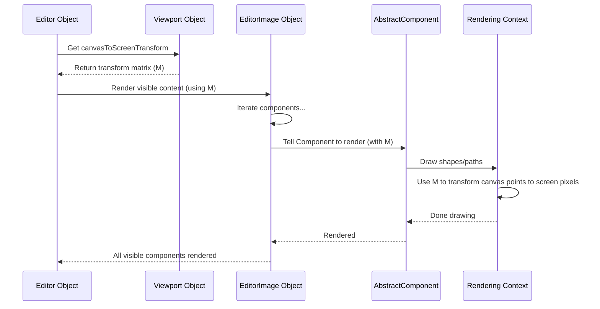

When you call `Viewport.transformBy(matrix)` and `editor.dispatch(command)`, the command's `apply` method updates the `Viewport`'s internal `canvasToScreenTransform` by combining the existing transform with the new `matrix` (specifically, `newTransform = oldTransform.rightMul(matrix)`). The viewport also updates its `screenToCanvasTransform` (which is the inverse of the `canvasToScreenTransform`).

### Other Viewport Features

The `Viewport` object provides other useful methods:

*   `visibleRect`: Returns a `Rect2` (rectangle) in canvas coordinates that represents the currently visible area of the drawing. Useful for knowing what part of the drawing is on screen.
*   `getScaleFactor()`: Returns the current zoom level. A value of 1 means 1 canvas unit = 1 screen pixel (no zoom relative to base).
*   `getRotationAngle()`: Returns the current rotation of the canvas relative to the screen, in radians.
*   `zoomTo(rect)`: A convenient method that computes and returns a [Command](08_command_.md) to pan and zoom the view so that a specific rectangular region (`rect` in canvas coordinates) becomes visible and centered.

These methods allow you to query the current state of the view and programmatically adjust it.

### Conclusion

The `Viewport` is a crucial part of the `js-draw` editor, managing how the **[EditorImage](02_editorimage_.md)** is displayed on the screen. It controls panning, zooming, and rotation by maintaining a transformation matrix between canvas and screen coordinates. You can access it via `editor.viewport`. To change the view, you create a transformation matrix (often using `Mat33` helpers), wrap it in a command using `Viewport.transformBy()`, and dispatch that command via `editor.dispatch()`. Understanding the `Viewport` is essential for controlling the user's perspective on the drawing.

Now that we've covered the core concepts of the editor instance, the drawing data, the drawing elements, the user interaction tools, and how the view is managed, let's look at how users typically select and configure these tools: the **AbstractToolbar**.

# Chapter 6: AbstractToolbar

Welcome back! So far, we've explored the fundamental pieces of `js-draw`: the **[Editor](01_editor_.md)** (the main application), the **[EditorImage](02_editorimage_.md)** (where your drawing lives as **[AbstractComponent](03_abstractcomponent_.md)**s), **[BaseTool](04_basetool_.md)**s (how users create and interact with components), and the **[Viewport](05_viewport_.md)** (how you see the drawing).

You know you need `BaseTool`s like a pen or an eraser to draw, but how do users actually *choose* which tool they want to use? How do they change the pen color or erase size? This is where the **AbstractToolbar** comes in.

### What is the AbstractToolbar?

Imagine the `Editor` is a complex machine with many functions (drawing, erasing, selecting, saving, etc.). The `AbstractToolbar` is the control panel for that machine.

It's a container specifically designed to hold user interface elements – things like buttons, sliders, color pickers, and menus. These elements act as controls that allow the user to:

*   Select the currently active **[BaseTool](04_basetool_.md)**.
*   Change settings for the active tool (like color, thickness, font size).
*   Perform actions on the editor (like undo, redo, save, load).

The `AbstractToolbar` itself is an **abstraction**. This means it defines the *concept* of a toolbar and its basic behavior (like holding controls), but it doesn't dictate *exactly* what it looks like or where it's placed. Different *subclasses* of `AbstractToolbar` handle the visual presentation, creating toolbars that might look like a floating menu, a sidebar, or a dropdown.

You interact with an `AbstractToolbar` instance by adding smaller UI pieces, called **Widgets**, to it.

### Adding Controls: Widgets

Everything you put *inside* a toolbar is represented as a **Widget**. `js-draw` has different classes for different types of widgets, all inheriting from a base `BaseWidget` class:

*   **Tool Widgets:** Represent a specific **[BaseTool](04_basetool_.md)** (like the pen button, eraser button). Clicking them typically activates that tool. They might also contain settings for the tool (like a color picker or size slider).
*   **Action Buttons:** Represent a one-time action (like undo, redo, save). Clicking them triggers that action.
*   **Insert Widgets:** For adding specific content (like inserting an image).
*   **Spacers:** Non-interactive elements used purely for layout, helping arrange other widgets.

The primary way to add any of these controls to an `AbstractToolbar` is using its `addWidget()` method.

### The Basic Use Case: Adding a Toolbar with Default Controls

The simplest way to get a functional control panel is to add a default toolbar to your editor. We already saw this in [Chapter 1](01_editor_.md):

```ts
import Editor from 'js-draw';
import 'js-draw/styles';

const containerElement = document.body;
const editor = new Editor(containerElement);

// Add the default toolbar
editor.addToolbar();

// This creates and adds a default concrete toolbar subclass
// (e.g., EdgeToolbar or DropdownToolbar) to the editor's container.
// It also populates it with default tool widgets and action buttons.
```

The `editor.addToolbar()` method is a convenience function that:
1.  Creates an instance of a concrete `AbstractToolbar` subclass (like `EdgeToolbar`).
2.  Adds this toolbar's HTML elements to the editor's container.
3.  Calls the toolbar's `addDefaults()` method.

The `addDefaults()` method is where the magic happens for beginners. It automatically adds a standard set of `BaseWidget`s for common tools and actions:

*   Widgets for primary tools (Pen, Eraser, Selection, Text, Pan/Zoom)
*   Buttons for Undo and Redo
*   Buttons for Save and Exit (placeholders unless you provide callbacks)
*   Widgets for inserting images and changing document properties.

So, calling `editor.addToolbar()` gives you a ready-to-use toolbar with the most common controls.

### Customizing the Toolbar

What if you want to add your *own* button, or only add a *subset* of the default controls? You interact directly with the `AbstractToolbar` instance.

Instead of relying entirely on `addDefaults()`, you can manually add the widgets you need. You can get a reference to a toolbar instance using factory functions like `makeDropdownToolbar` or `makeEdgeToolbar` (which create specific `AbstractToolbar` subclasses) and then use their methods.

Here's how you could create a dropdown toolbar and add just the undo/redo buttons and a custom action button:

```ts
import Editor, { makeDropdownToolbar } from 'js-draw';
import 'js-draw/styles';

const editor = new Editor(document.body);

// Create a dropdown toolbar instance (a concrete AbstractToolbar)
const toolbar = makeDropdownToolbar(editor);

// Manually add some default controls
toolbar.addUndoRedoButtons();

// Add a custom action button
toolbar.addActionButton('Show Alert', () => {
    alert('Hello from a custom button!');
});

// The toolbar won't appear until you add its HTML element to the DOM.
// makeDropdownToolbar/makeEdgeToolbar return the toolbar instance,
// but you still need to place its root element.
// editor.addToolbar() does this automatically.
// If you use makeDropdownToolbar/makeEdgeToolbar, you might need:
// editor.addToolbar(toolbar); // Some toolbars can be added this way
// OR manually append:
// document.body.appendChild(toolbar.getRootElement()); // Depending on toolbar type

// For simplicity in this example, let's use the addToolbar helper
// and then add to that toolbar (though addToolbar already adds defaults)
// Let's modify the previous example to add to the default toolbar:
const defaultToolbar = editor.addToolbar(); // Adds default toolbar and its defaults

// Add a custom button to the default toolbar:
defaultToolbar.addActionButton('Custom Button', () => {
    console.log('Custom button clicked!');
});

// You will see the default toolbar PLUS your custom button.
```

The `addActionButton()` method is particularly useful for adding simple buttons that trigger any JavaScript code you want. It takes the button's title/icon and a callback function to run when clicked.

You can also add widgets for specific tools individually using methods like `addWidgetsForPrimaryTools()` or add other utility widgets using `addDefaultEditorControlWidgets()`.

### Under the Hood (Simplified)

How does the `AbstractToolbar` manage its widgets and display them?

1.  **Internal Storage:** An `AbstractToolbar` instance holds an internal list or map of all the `BaseWidget` objects that have been added to it using `addWidget()`.
2.  **HTML Creation:** When a widget is added via `addWidget()`, the `AbstractToolbar` calls an internal method (`addWidgetInternal`). Concrete subclasses (like `EdgeToolbar` or `DropdownToolbar`) implement `addWidgetInternal` to create the actual HTML elements for the widget (like a `<button>` or `<div>`) and append them to the toolbar's main HTML element.
3.  **Event Handling:** When a user interacts with a widget's HTML element (e.g., clicks a button), the browser triggers an event. This event propagates up through the HTML elements. The toolbar (or the widget itself) listens for these events. When a click is detected on a button, the widget's associated callback function (like the one provided to `addActionButton`) is executed.
4.  **State Management:** Some widgets (like tool widgets) need to reflect the current state of the editor (e.g., which tool is active, what color is selected). They listen for editor events (via the editor's `notifier`) and update their appearance accordingly.

Here's a simplified sequence diagram focusing on adding a button and clicking it:

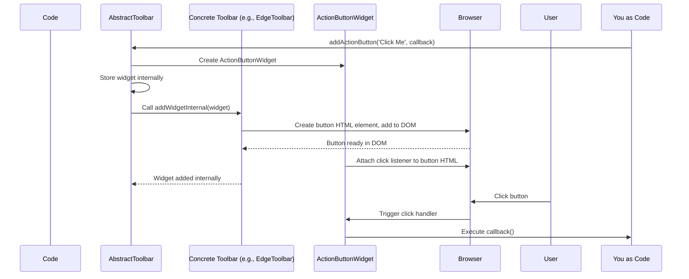

The `AbstractToolbar` provides the common structure and methods (`addWidget`, `addActionButton`, etc.), while the specific `EdgeToolbar` or `DropdownToolbar` handles the visual presentation and places the widget's HTML (`addWidgetInternal` is called internally).

You can see the `AbstractToolbar` definition in the source file `packages/js-draw/src/toolbar/AbstractToolbar.ts`. Look for the `addWidget` and `addWidgetInternal` methods, and how it stores widgets in `#widgetsById` and `#widgetList`.

### Different Toolbar Styles

As mentioned, `AbstractToolbar` is a base class. `js-draw` provides at least two built-in concrete implementations:

*   **`EdgeToolbar`:** Typically positions widgets along one edge of the editor.
*   **`DropdownToolbar`:** Often appears as a single button that, when clicked, reveals a dropdown menu containing the widgets.

The `editor.addToolbar()` helper function uses the `EdgeToolbar` by default, unless configured otherwise. You can explicitly create them using `makeEdgeToolbar(editor)` or `makeDropdownToolbar(editor)` and then manually add them to the editor or its container.

### Removing a Toolbar

If you need to remove a toolbar (e.g., when switching between different toolbar styles as shown in the `Writing a theme` example code), the `AbstractToolbar` provides a `remove()` method:

```ts
// Assuming 'editor' and 'defaultToolbar' from previous examples

// Remove the toolbar from the display and clean up its resources
defaultToolbar.remove();

// The toolbar and its widgets are no longer visible or active.
```

The `remove()` method cleans up the HTML elements and removes any event listeners the toolbar or its widgets might have registered.

### Conclusion

The `AbstractToolbar` serves as the control panel for the `js-draw` editor. It's an abstraction that defines how user interface **Widgets** (buttons, sliders, etc.) are managed. You add widgets to a concrete `AbstractToolbar` instance (like an `EdgeToolbar` or `DropdownToolbar`) using methods like `addWidget` or convenience methods like `addActionButton` and `addDefaults`. It handles storing the widgets, asking them to create their HTML elements, and routing user input to them. Understanding the `AbstractToolbar` is key to providing users with interactive controls for your drawing application.

These toolbar widgets often interact with the editor's **[BaseTool](04_basetool_.md)**s. But how does the editor keep track of which tool is currently active, and how does it switch between them? That's the job of the **ToolController**.

# Chapter 7: ToolController

Welcome back! In the [previous chapter](06_abstracttoolbar_.md), we explored the **AbstractToolbar**, the user interface element that provides controls for selecting **BaseTools** and changing their settings.

You know that **BaseTools** are how users interact with the drawing, but how does the editor know *which* tool the user wants to use right now? If the user clicks the Pen icon on the toolbar and then starts dragging on the canvas, how does that click and drag input get directed specifically to the Pen tool and not, say, the Eraser tool?

This is the crucial job of the **ToolController**.

### What is the ToolController?

Think of the **ToolController** as the central switchboard or traffic controller for all your **BaseTools**. It sits between the **[Editor](01_editor_.md)** (which receives raw user input events) and the various **[BaseTool](04_basetool_.md)** instances.

Its main responsibilities are:

1.  **Managing Tools:** It keeps track of *all* the **[BaseTool](04_basetool_.md)**s available in the editor.
2.  **Determining the Active Tool:** For pointer-based interactions (mouse clicks, touches), it decides which single tool should currently receive that input. This is often the tool the user most recently selected from a toolbar.
3.  **Routing Input:** It receives raw input events from the **[Editor](01_editor_.md)** and dispatches them to the appropriate **[BaseTool](04_basetool_.md)**(s).
4.  **Managing Tool Groups:** It handles groups of tools where only one tool within the group can be active at any given time (like the main drawing tools).
5.  **Adding/Removing Tools:** It provides methods to programmatically add new tools or remove existing ones.

Essentially, the `ToolController` makes sure the right tool is listening when the user interacts with the drawing area.

### Accessing the ToolController

The **[Editor](01_editor_.md)** instance holds and manages a single `ToolController`. You can access it via the `.toolController` property of your editor object.

```ts
import Editor from 'js-draw';
import 'js-draw/styles';

const containerElement = document.body;
const editor = new Editor(containerElement);
editor.addToolbar();

// Get the ToolController instance from the editor
const myToolController = editor.toolController;

console.log('The Editor has a tool controller:', myToolController instanceof ToolController);
```

The `myToolController` variable now holds the object responsible for managing the tools in this editor instance.

### Routing Input Events

When you click, drag, or type in the editor's drawing area, the **[Editor](01_editor_.md)** receives these raw events from the browser. The **[Editor](01_editor_.md)** then passes these events to its `ToolController`'s `dispatchInputEvent()` method.

The `ToolController` then performs its logic to figure out which tool should handle the event. For primary pointer events (`PointerDown`, `PointerMove`, `PointerUp`), it typically sends them to the currently designated "active tool". For other events (like keyboard shortcuts), it might offer them to multiple tools until one indicates it has handled the event.

Here's a simplified flow for how a mouse down event reaches a tool:

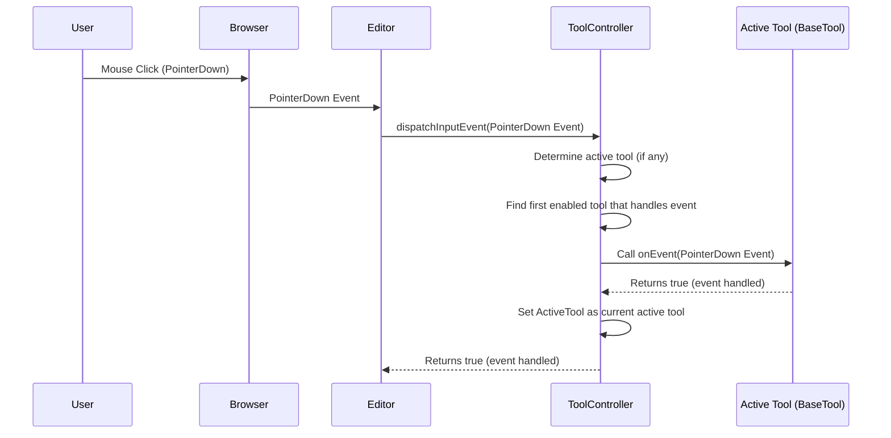

The `ToolController`'s `dispatchInputEvent` method is the main entry point for all user input events after they are received by the `Editor`.

### The Active Tool

For pointer interactions (mouse, touch, stylus), `js-draw` generally assumes only one tool is actively "drawing" or "selecting" at a time. This is managed by the `ToolController`'s concept of an **active tool**.

When a `PointerDown` event occurs:
1.  The `ToolController` iterates through its list of **[BaseTool](04_basetool_.md)**s.
2.  For each tool, it checks if the tool is enabled (`tool.isEnabled()`).
3.  It calls the tool's `onEvent(event)` method for the `PointerDown` event.
4.  The first enabled tool that returns `true` from its `onEvent` method (indicating it wants to handle this pointer sequence) becomes the **active tool**.
5.  Subsequent `PointerMove` and `PointerUp` events for *that specific pointer* are then routed directly to this active tool until the `PointerUp` event is handled or the gesture is cancelled.

This is how clicking the Pen tool on the toolbar (which typically calls `penTool.setEnabled(true)`) and then clicking/dragging on the canvas makes the Pen tool the active tool that receives the drag events.

### Tool Groups (Primary Tools)

Many drawing applications have a set of tools where you can only use one at a time: the Pen, the Eraser, the Selection tool, the Text tool, etc. You can't draw with the pen *and* erase at the same time using the primary pointer.

The `ToolController` manages this using **ToolEnabledGroups**. A `ToolEnabledGroup` is a simple object that keeps track of a set of tools. When one tool within a group is enabled, the `ToolEnabledGroup` automatically disables all other tools within that same group.

The `ToolController` has a special group called the `primaryToolGroup`. When you add a tool to this group (e.g., using `tool.setToolGroup(toolController.primaryToolGroup)`), it becomes part of this exclusive set. Tools like the built-in `PenTool`, `EraserTool`, and `SelectionTool` are typically added to this group by default.

This is how clicking the Eraser button on the toolbar automatically deactivates the Pen tool: the toolbar button enables the Eraser tool, which is in the `primaryToolGroup`. The `ToolEnabledGroup` sees the Eraser is enabled and tells the previously active Pen tool (also in the group) to disable itself.

Tools *not* in the `primaryToolGroup` (like keyboard shortcuts for undo/redo or the Pan/Zoom tool configured for two-finger gestures) can often be active or handle events simultaneously with a primary tool.

### Adding and Getting Tools

The `ToolController` manages the list of tools it knows about. While the default `editor.addToolbar()` sets up a standard set of tools and adds them to the controller, you can also manually add tools or retrieve specific tools.

To add a tool (e.g., a custom tool you've created, which is an instance of a class extending **[BaseTool](04_basetool_.md)**):

```ts
import Editor from 'js-draw';
import { ToolController, BaseTool } from 'js-draw/tools'; // Import ToolController and BaseTool
import 'js-draw/styles';

// Assume you have a custom tool class
class MyCustomTool extends BaseTool {
    // ... implementation of onEvent, description, etc.
    // For this example, we'll just make a dummy tool that logs clicks
    onEvent(event) {
        if (event.kind === 'pointerDown') {
            console.log('My custom tool clicked!');
            return true; // Indicate that we handled the event
        }
        return false; // Didn't handle other events
    }

    description() { return 'My Custom Tool'; }
    // BaseTool requires implementing other methods like onToolEnable, onToolDisable, etc.
    // These are omitted for simplicity in this minimal example.
    onToolEnable() { }
    onToolDisable() { }
    onDestroy() { }
    getIcon() { return ''; } // No icon for this example
}


const editor = new Editor(document.body);
// Don't add the default toolbar yet if you want to control the tool list
// editor.addToolbar();

const customTool = new MyCustomTool(editor, 'myCustom'); // Tools need an editor and a unique ID

// Get the tool controller
const toolController = editor.toolController;

// Add the custom tool to the controller's list
// By default, it's added to the end and is NOT part of the primary group
toolController.addTool(customTool);

// If you wanted it to be a primary tool (disabling others when active):
// toolController.addPrimaryTool(customTool);

// Now, if you were to build a custom toolbar, you could add a widget for customTool.
// Or if this tool handles keyboard shortcuts, it might start receiving events.

// If you later want to add the default toolbar BUT include your custom tool:
const defaultToolbar = editor.addToolbar(); // Adds toolbar *and* default tools
// You might need to re-add your tool or ensure it was added before the toolbar if
// you want it included in default toolbar lists.
// Often, you modify the tool list *before* creating the toolbar.
```
*Note: Adding/removing tools using methods like `setTools`, `addTool`, `addPrimaryTool` is typically done during the editor's setup phase, before any toolbars are created, to ensure the tool list is finalized for toolbar creation.*

To find a specific tool or all tools of a certain type, you can use `getMatchingTools()`:

```ts
// Assuming 'editor' instance is created and default tools are added via addToolbar()

const toolController = editor.toolController;

// Find all PenTool instances managed by the controller
const penTools = toolController.getMatchingTools(PenTool); // PenTool needs to be imported

if (penTools.length > 0) {
    console.log(`Found ${penTools.length} Pen tool(s).`);
    // You can now access properties or methods specific to PenTool on penTools[0]
    // e.g., penTools[0].setColor(Color4.blue); // Needs Color4 import
}
```

This is how the toolbar gets references to the actual tool instances so it can create widgets that control them.

### Under the Hood (Simplified)

The `ToolController`'s core logic revolves around its internal list of tools (`this.tools`) and the currently active pointer tool (`this.activeTool`).

When `dispatchInputEvent(event)` is called:

1.  If the event is `PointerMove` or `PointerUp`, and there is an `activeTool` that handled the initial `PointerDown`, the event is typically sent *only* to that `activeTool`.
2.  If the event is `PointerDown` or a non-pointer event (like a keyboard event):
    *   The `ToolController` iterates through `this.tools` in order.
    *   For each tool, it checks if `tool.isEnabled()` is true.
    *   For non-pointer events, it calls `tool.onEvent(event)`. If it returns `true`, the event is considered handled, and the loop stops.
    *   For `PointerDown`, it calls `tool.onEvent(event)`. If it returns `true`, this tool becomes the `activeTool`, and the loop stops.

The source code for `ToolController` (`packages/js-draw/src/tools/ToolController.ts`) shows this logic within the `onEventInternal` method. You can see how it iterates through `this.tools` and sets `this.activeTool` when a tool handles a `PointerDown` event. It also manages the `primaryToolGroup` and other tool groups.

```typescript
// Snippet from ToolController.ts (simplified)
// onEventInternal(event: InputEvt): boolean {
//     // ... readOnly check ...
//     const canToolReceiveInput = (tool: BaseTool) => {
//         return tool.isEnabled() && (!isEditorReadOnly || tool.canReceiveInputInReadOnlyEditor());
//     };
//
//     if (event.kind === InputEvtType.PointerDownEvt) {
//         // Iterate tools to find one that handles the PointerDown
//         for (const tool of this.tools) {
//             if (canToolReceiveInput(tool) && tool.onEvent(event)) { // Call tool's onEvent
//                 // If tool handled it, it becomes the active tool
//                 this.activeTool?.onEvent({ kind: InputEvtType.GestureCancelEvt }); // Cancel previous
//                 this.activeTool = tool;
//                 return true; // Event handled
//             }
//         }
//     } else if (event.kind === InputEvtType.PointerUpEvt || event.kind === InputEvtType.PointerMoveEvt || event.kind === InputEvtType.GestureCancelEvt) {
//         // For move/up/cancel, send only to the active tool if one exists
//         if (this.activeTool !== null) {
//             const handled = this.activeTool.onEvent(event);
//             if (event.kind === InputEvtType.PointerUpEvt && !handled) {
//                  // If active tool didn't handle the PointerUp (e.g., finished its task),
//                  // or if only one pointer is left, clear active tool.
//                  this.activeTool = null;
//             } else if (event.kind === InputEvtType.GestureCancelEvt) {
//                  this.activeTool = null;
//             }
//             return handled; // Assume handled if active tool exists
//         }
//     } else {
//         // For other events (keyboard, etc.), let enabled tools handle in order
//         for (const tool of this.tools) {
//             if (canToolReceiveInput(tool) && tool.onEvent(event)) {
//                 return true; // Event handled
//             }
//         }
//     }
//     return false; // Event not handled by any tool
// }
```
This simplified view shows the core dispatch logic: find a handler for `PointerDown` to set `activeTool`, and then route subsequent pointer events to that `activeTool`. Other events are offered to enabled tools in order until one handles it.

### Conclusion

The `ToolController` is the unsung hero of the `js-draw` input system. It acts as the central manager for all **[BaseTool](04_basetool_.md)**s, receiving input events from the **[Editor](01_editor_.md)** and routing them to the appropriate tool, often designating one tool as the "active" handler for pointer interactions. It also manages **ToolEnabledGroup**s to ensure only one primary tool is active at a time. You access it via `editor.toolController` to retrieve or add tools.

You now have a good understanding of the main components: the editor application (`Editor`), the drawing data (`EditorImage`), the individual drawing elements (`AbstractComponent`), how users interact (`BaseTool`), how the view is controlled (`Viewport`), how users select tools (`AbstractToolbar`), and how input gets routed to the right tool (`ToolController`).

Many of the actions performed by tools (like drawing a line or deleting a shape) are encapsulated in **Commands**, which enable undo/redo functionality. In the next chapter, we'll explore this powerful concept.

# Chapter 8: Command

Welcome back! In the [previous chapter](07_toolcontroller_.md), we learned about the **ToolController**, the central manager that decides which **[BaseTool](04_basetool_.md)** gets to handle user input events like mouse clicks and drags. These tools then perform actions that change the drawing, which is stored in the **[EditorImage](02_editorimage_.md)** as **[AbstractComponent](03_abstractcomponent_.md)**s.

But what if a user makes a mistake? What if they want to undo the last line they drew, or redo an action they just undid? This fundamental feature of most editors requires a way to not just *do* an action, but also to *reverse* it.

This is where the concept of a **Command** becomes essential.

### What is a Command?

Imagine every significant action you take in the editor – drawing a stroke, deleting a shape, changing the text in a text box, transforming an image. Each of these is a single, distinct action.

In `js-draw`, a **Command** is a digital object that represents one of these actions that modifies the drawing. It's not the action *itself* happening in real-time, but rather a blueprint or package describing the action.

The key characteristic of a `Command` is that it knows two things:

1.  How to **apply** its effect to the editor's drawing.
2.  How to **unapply** (reverse) its effect.

Think of a `Command` as a reversible instruction: "Add this stroke" (apply) and "Remove this stroke" (unapply); or "Delete this shape" (apply) and "Bring back this shape" (unapply).

### Why Use Commands? The Need for Undo/Redo

The most immediate and important reason for using `Command` objects is to enable **undo** and **redo** functionality.

The `js-draw` **[Editor](01_editor_.md)** keeps a history of all the `Command`s that have been dispatched (more on dispatching soon). This history is typically stored in two lists or "stacks":

*   **Undo Stack:** Contains commands that have been applied.
*   **Redo Stack:** Contains commands that have been undone.

When you click "Undo", the editor takes the last `Command` from the undo stack, calls its `unapply()` method to reverse its effect, and moves it to the redo stack.

When you click "Redo", the editor takes the last `Command` from the redo stack, calls its `apply()` method to re-do its effect, and moves it back to the undo stack.

This system works seamlessly because every `Command` follows the `apply` / `unapply` contract.

Commands are also useful for things like collaborative editing, where actions performed by one user need to be represented, sent over a network, and applied on another user's editor.

### Core Methods: `apply` and `unapply`

Every `Command` object in `js-draw` must implement two fundamental methods:

*   `apply(editor)`: This method contains the logic to perform the action the command represents. It takes the `Editor` instance as an argument, allowing it to interact with the `editor.image`, `editor.viewport`, etc.
*   `unapply(editor)`: This method contains the logic to reverse the action performed by `apply()`. It also receives the `Editor` instance.

```ts
// Example (simplified): A Command to add a component
import Editor from '../Editor'; // Assuming relative path
import AbstractComponent from '../AbstractComponent'; // Assuming relative path

// This is an abstract concept, you don't create Command directly
// You create instances of classes that extend Command
abstract class Command {
    // ... other required methods like description()

    abstract apply(editor: Editor): Promise<void> | void;
    abstract unapply(editor: Editor): Promise<void> | void;

    // onDrop is called when the command is removed from history
    onDrop(_editor: Editor) {}
}
```
This snippet shows the basic structure of the `Command` class with its core methods. Actual commands, like adding a component, are subclasses.

For an `AddComponentCommand`, the `apply` method would tell the `EditorImage` to add the component, and the `unapply` method would tell the `EditorImage` to remove it.

### Using Commands: The `editor.dispatch()` Method

You don't typically call `command.apply(editor)` or `command.unapply(editor)` directly yourself (unless you have a specific reason to bypass the history system).

Instead, you tell the **[Editor](01_editor_.md)** to handle the command for you using the `editor.dispatch(command)` method.

```ts
editor.dispatch(myCommand);
```

When you call `editor.dispatch(command)`, the editor does several important things:

1.  It calls `command.apply(editor)` to perform the action.
2.  It adds the `command` to the editor's internal undo stack.
3.  It clears the redo stack (because performing a new action after undoing something usually means you can no longer redo the previous actions).
4.  It notifies listeners (like the undo/redo buttons on a toolbar) that the undo/redo history has changed.

This is the standard way to make any change to the drawing that you want to be reversible.

### Minimal Example: Adding a Component with a Command

Let's revisit the example from [Chapter 2](02_editorimage_.md) where we added a red box, but this time we'll focus on the `Command` part.

Remember the helper function `addBox`:

```ts
import Editor, { Stroke, pathToRenderable, RenderingStyle } from 'js-draw';
import { Path, Color4, Rect2 } from '@js-draw/math';
import 'js-draw/styles';

const containerElement = document.body;
const editor = new Editor(containerElement);
editor.addToolbar();

// --- Helper function to add a simple filled rectangle ---
function addBox(editorInstance: Editor, rect: Rect2, color: Color4) {
    // 1. Create the component (a Stroke in this case)
	const path = Path.fromRect(rect);
	const style: RenderingStyle = { fill: color };
	const stroke: Stroke = new Stroke([ pathToRenderable(path, style) ]);

    // 2. Ask the EditorImage for a Command to add this component!
    //    editorInstance.image returns an EditorImage,
    //    and EditorImage has a method addComponent that returns a Command.
	const addCommand = editorInstance.image.addComponent(stroke);

    // 3. Dispatch the command to the editor to execute it and add to history
	editorInstance.dispatch(addCommand);
}
// --------------------------------------------------------

// Add a red box
const boxRect = new Rect2(100, 50, 40, 30);
const redColor = Color4.red;
addBox(editor, boxRect, redColor);

// After running this, a red box appears. If you had undo enabled (e.g., via toolbar),
// you could now undo this action.
```

**Explanation focusing on Command:**

1.  We create the `stroke` object, which is an **[AbstractComponent](03_abstractcomponent_.md)**.
2.  Instead of adding it directly, we call `editorInstance.image.addComponent(stroke)`. This method doesn't change the image immediately; it *returns* an instance of a `Command` subclass (specifically, an `AddComponentCommand`). This `addCommand` object knows how to add the `stroke` (`apply`) and remove the `stroke` (`unapply`).
3.  We pass this `addCommand` to `editorInstance.dispatch()`. This tells the editor, "Please execute this action for me, and make it part of the undo/redo history."

The `editor.dispatch()` call is the bridge between creating a `Command` and having it affect the drawing and the history.

### `dispatch()` vs. Direct `apply()`

What happens if you call `addCommand.apply(editorInstance)` directly instead of `editorInstance.dispatch(addCommand)`?

```ts
// ... (previous code to create editor and stroke) ...

// Instead of editor.dispatch(addCommand);
addCommand.apply(editor);

// The red box will still appear on the canvas!
// However, this action IS NOT added to the undo history.
// The undo/redo buttons (if present) will not be affected by this change.
```

Calling `command.apply(editor)` simply executes the command's action logic immediately. It bypasses the `UndoRedoHistory` system entirely.

You might do this for temporary changes you don't want users to be able to undo, but most drawing modifications should go through `editor.dispatch()`.

### Under the Hood: How `editor.dispatch` Manages History

The **[Editor](01_editor_.md)** object contains an internal `UndoRedoHistory` object (you can see this in the `UndoRedoHistory.ts` source file). This object holds the `#undoStack` and `#redoStack` (private properties, hence the `#`).

When you call `editor.dispatch(command)`:

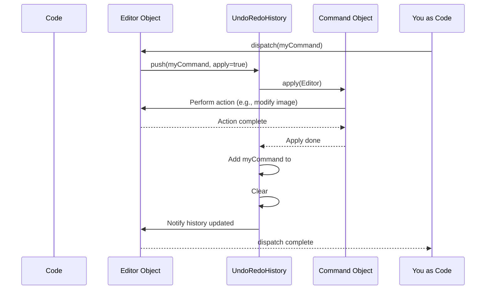

When you click the "Undo" button (which internally calls `editor.undo()`):

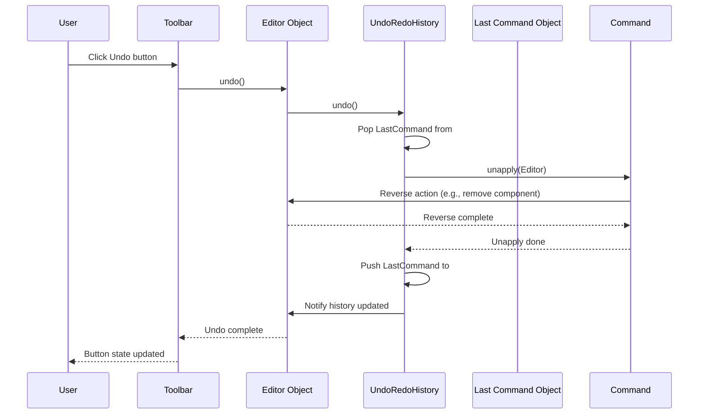

Similarly, `editor.redo()` calls `History.redo()`, which pops from `#redoStack`, calls `apply()`, pushes to `#undoStack`, and notifies.

This explains why `dispatch` clears the redo stack: the `History.push` method does this.

You can see the `push`, `undo`, and `redo` methods on the `UndoRedoHistory` class in the source code (`packages/js-draw/src/UndoRedoHistory.ts`).

### Built-in Commands

`js-draw` provides several built-in `Command` subclasses for common operations:

*   **Adding/Removing Components:** Commands created by `editor.image.addComponent()`, `editor.image.removeComponent()`.
*   **Transforming Components:** Commands created by methods on `AbstractComponent` like `component.transformBy()`, `component.updateStyle()`.
*   **`Erase`:** A command specifically for removing a set of components (`new Erase(componentsToDelete)`).
*   **`Duplicate`:** A command for creating copies of components (`new Duplicate(componentsToDuplicate)`).
*   **`Viewport.transformBy()`:** Creates a command to change the viewport.
*   **`uniteCommands(...)`:** A utility function that takes multiple commands and combines them into a single `Command` that applies/unapplies all of them together. This is useful for grouping many small changes (like adding points during a stroke) into one undoable step, as shown in the example code in `docs/doc-pages/pages/guides/components/strokes.md`.

When building your own tools or features that modify the drawing, you'll either use these existing command creation methods or potentially define your own custom `Command` subclass for unique actions.

### Conclusion

The `Command` object is the cornerstone of `js-draw`'s undo/redo system and history management. It's a pattern where any action that changes the drawing is encapsulated in an object that knows how to both perform (`apply`) and reverse (`unapply`) itself. By dispatching commands using `editor.dispatch()`, you automatically gain undo/redo support, as the editor manages a history stack of these reversible actions. Understanding commands is crucial for building features that modify the drawing content reliably and providing a good user experience with undo/redo.

You have now learned about all the core concepts outlined in this tutorial structure: the main editor (`Editor`), the drawing data (`EditorImage`), the drawing elements (`AbstractComponent`), how users interact (`BaseTool`), how the view is managed (`Viewport`), how users select tools (`AbstractToolbar`), how input is routed (`ToolController`), and how actions are made reversible (`Command`).

This concludes the introductory tutorial covering the main building blocks of the `js-draw` library. From here, you can explore the library's API documentation, look at the examples provided in the `js-draw` repository, or dive into the source code of the built-in tools and commands to learn more about how they are implemented.
